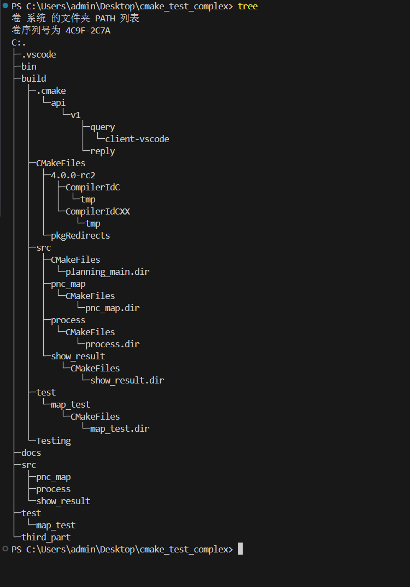
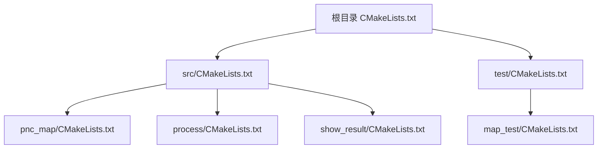
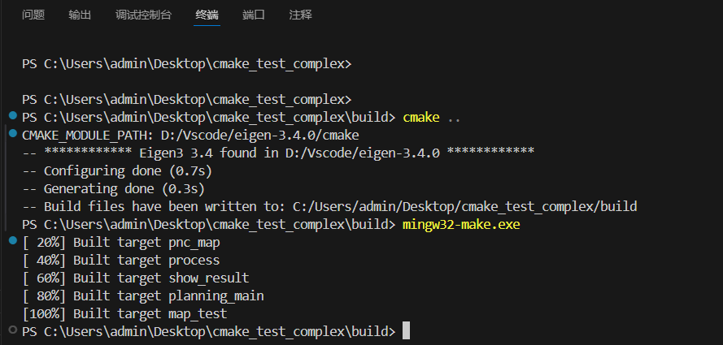

# cmake_test_complex
a demo for complex cmake test 

## 准备工作

### GitHub上新建一个仓库

1. 仓库名字
2. 添加描述 描述会被自动添加到 README.md 文件里
3. 选择私有或公开
4. 添加REAMDE.md
5. 选择忽略文本的语言为 C++ 或者 cmake
6. 选择许可证为MIT License
7. 创建即可

### 克隆仓库到本地

一般 HTTPS 即可 把仓库的代码地址复制下来终端使用 git clone 命令克隆下载到本地用vscode打开

## 构建方式之分目录构建

### 创建必要文件和目录

写代码前要创建必要的目录用于管理代码 可以用 tree /f 命令查看项目树

* bin ：存放编译生成的可执行文件（`.exe`）和动态库（`.dll`）
* build ：CMake 构建过程的临时文件和缓存
* src ：项目核心源代码
* src/pnc_map ：地图数据处理（含 `pnc_map.h/cpp`）
* src/process ：业务逻辑处理
* src/show_result ：结果可视化（依赖 三方库）
* test ：单元测试和集成测试代码
* docs :项目文档（如设计文档、API 说明）
* third-party :第三方库（如 Eigen3、EasyX）
* CMakeLists.txt 用于管理项目

cmakelists.txt 文件关系图

## 一键构建

构建完之后我们可以借助 cmake 插件 点击生成 然后就会一键构建我们的项目

或者 cd到build目录下 输入 cmake .. 然后输入 make 同样可以

## 问题

版本0.01存在一个问题就是CTest测试阶段失败（退出码8）还未修复
